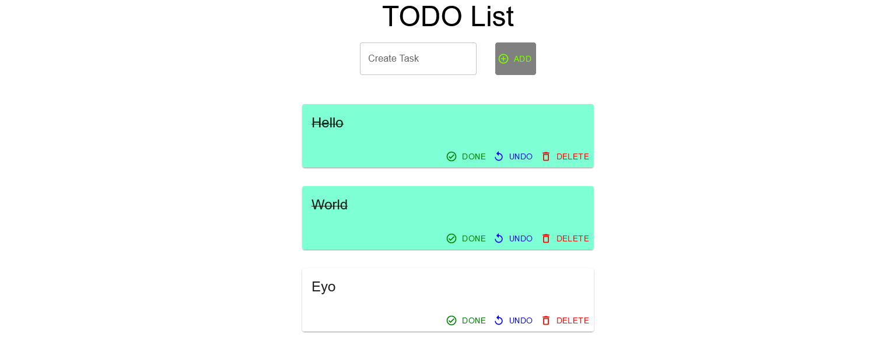

# :memo: Go To Do App
Ứng dụng web được tham khảo từ [go-to-do-app](https://github.com/schadokar/go-to-do-app)

## Kiến trúc Cloud

Server: Golang

Client: React, Mui

Database: Cosmo DB (MongoDB)

Trong đó
- Server và Client chạy trên 2 dịch vụ Azure Virtual Machine
- Database sử dụng dịch vụ Azure Cosmo DB

# Yêu cầu cài đặt
Biến môi trường:
- Server: 
   - DB_URI: Chuỗi kết nối (Dùng để kết nối đến dịch vụ Cosmo DB)
   - DB_NAME: Tên cơ sở dữ liệu
   - DB_COLLECTION_NAME: Tên Collection trong cơ sở dữ liệu
- Client:
   - SERVER_URL: dùng để kết nối đến Server

# Chạy ứng dụng Web
1. Trong thư mục os-demo, chạy file main.go bằng lệnh: go run main.go
2. Trong thư mục frontend,

   a. Cài các gói phụ thuộc: npm install

   b. Chạy frontend: npm start

# Một số hình ảnh về trang web
Truy cập ứng dụng bằng đường link của Azure tại cổng 3000.

## Index page
Có 1 số todo item có sẵn do nằm trong database
![][def]

[def]: ./images/index.PNG

## Create TODO task
Thêm task create1

## Delete TODO task
Xóa 2 task hello1 và create1

## Complete TODO task
Chọn "done", task sẽ bị gạch đi và chuyển nền xanh biểu thị task đã hoàn thành.

## Undo Completed TODO task
Sau khi chọn "done" có thể chọn "undo" để xóa xác nhận task đã hoàn thành, ở đây undo task "World".
